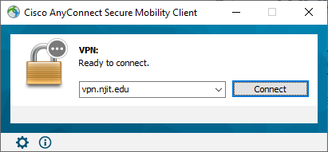
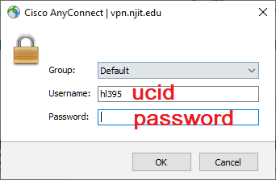
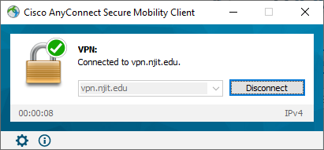
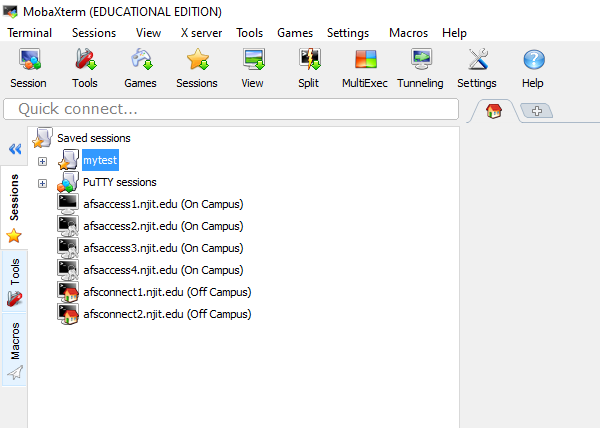
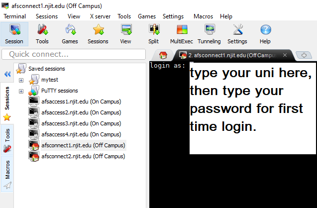
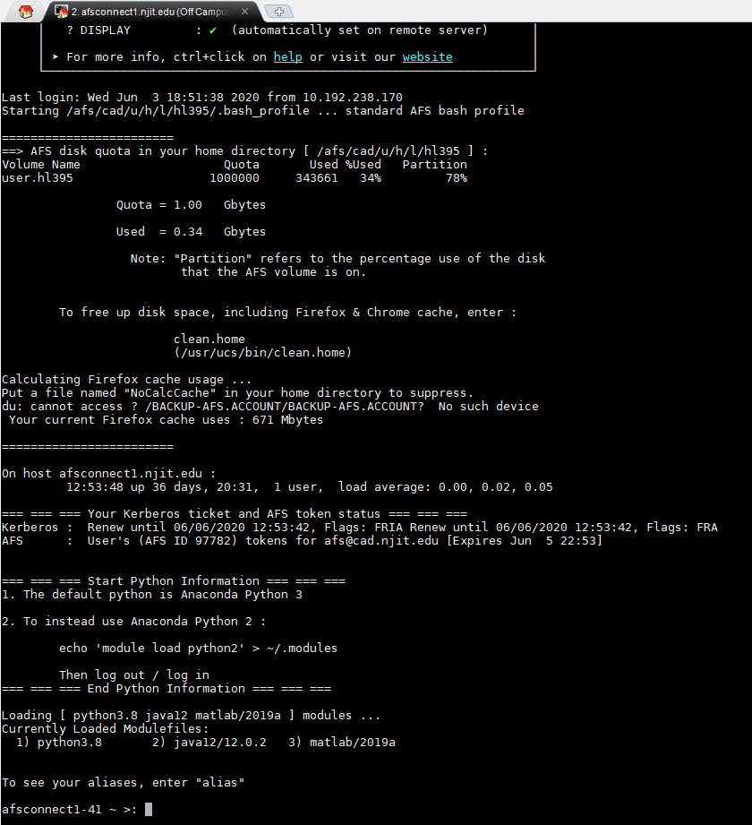
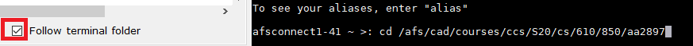
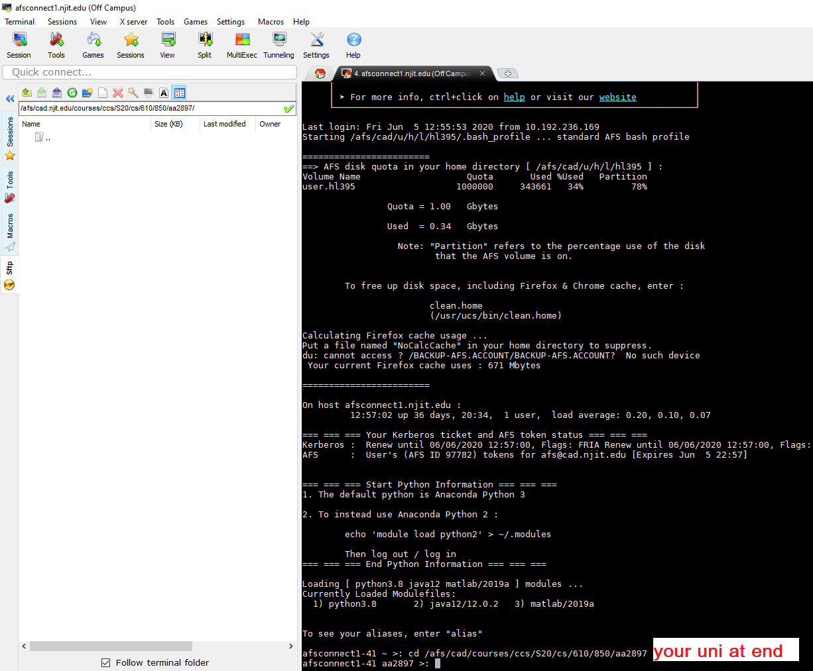
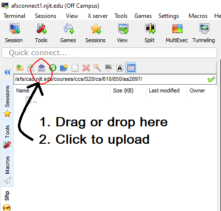
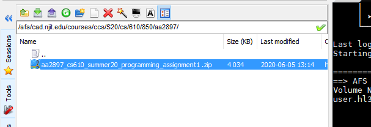

# afs
Help note on how to upload files to AFS machines for NJIT students.

## VPN (for off-campus only)
For students who are off-campus, you need to install VPN before connecting to AFS. 
1. Download Cisco Any conncet, detailed instructions can be found here [NJIT VPN](https://ist.njit.edu/vpn), .
2. Once installed, follow these instructions to connect.
    2.1 Launch the Cisco AnyConnect app. 
    
    2.2 Enter vpn.njit.edu as the address and click Connect. \
        
        
    2.3 Log in using your UCID. \
        
        
    2.4 Verify your connection.
        

### SSH to AFS Server
You can connect to AFS server by SSH. 
You are free to use other SSH clients to connect to Kong. 
Here is an example of using MobaXterm for Windows users. 
1. Go to [njit software download](http://ist.njit.edu/software-available-download/)
2. Download and install MobaXterm (for Windows users only). Open MobaXterm, you will see:
    
3. Double click on afsaccess1.njit.edu (on campus) to SSH with port 22 if you are on campus.  
   Or double click on afsconnect1.njit.edu (off campus) to SSH with port 22 if you are off campus.
    
    Feel free to select from afsaccess1-4 or afsconnect1-2.

4. Use your NJIT credentials to log in to Kong. The connection is established if you see a command prompt:
    
    
### Upload a file to AFS directory:
For example, if your ucid is **aa2897**, then you can follow the steps below:
1. Check the "Follow terminal folder" checkbox. This will automatically navigate to the directory you wish to go:
    

2. For students enrolled CS610 850 summer 2020, the directory `/afs/cad/courses/ccs/S20/cs/610/850/` is created for you to upload you programming assignment. 
    
    Type `cd /afs/cad/courses/ccs/S20/cs/610/850/aa2897`. Note the **aa2897** part is your ucid, pleasee change it to your own ucid.
 
3. Then you will see the directory similar to this:
    
    
4. Drug and drop the file you want to upload in the left white space or Click on the 'Upload' icon.
    

5. After upload is done, you should see it appears on the left panel.
    

